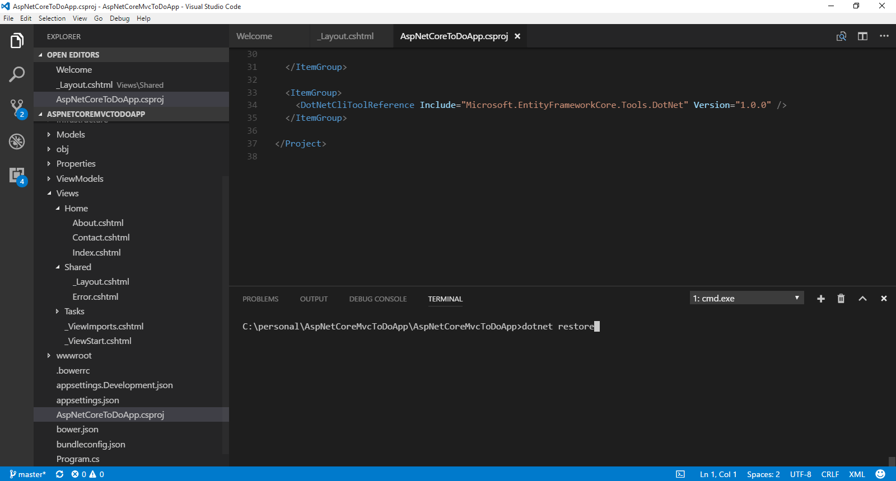
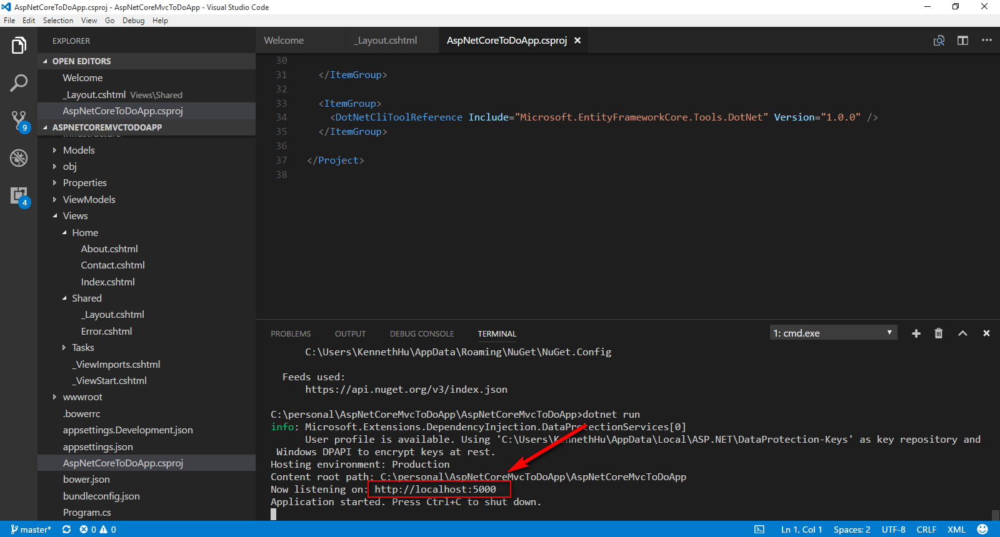
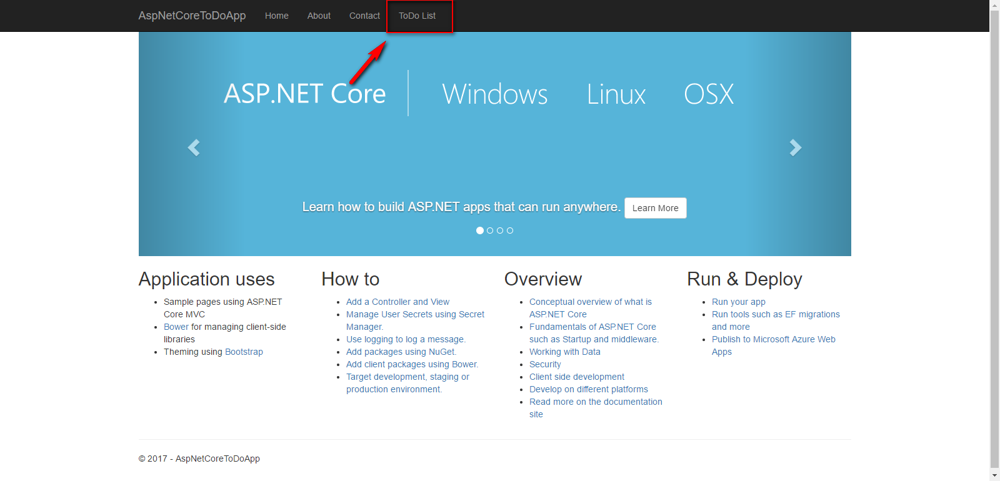
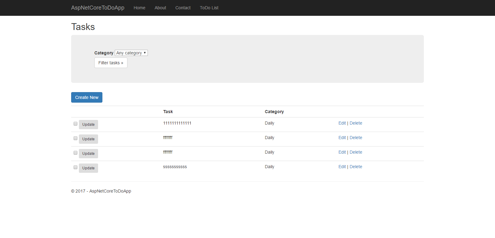
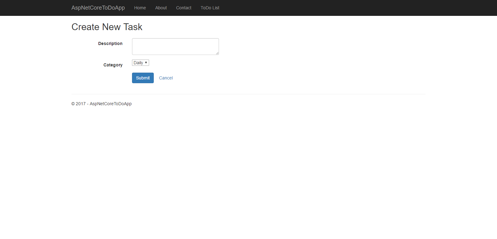
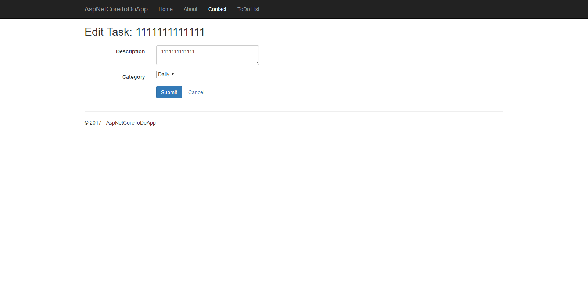
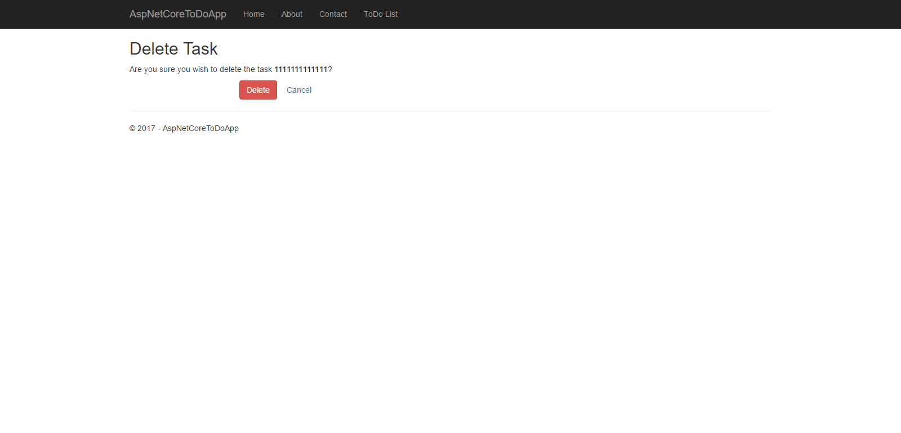

# AspNetCoreMvcToDoApp
AspNetCoreMvcToDoApp

The Github Repo of TodoApp using ASP.NET Core MVC.

## Step 1. Create Database in MSSQL Server 

  Script : AspNetCoreMvcToDoAppDBSchema.sql (including Database )

  Script : AspNetCoreMvcToDoAppDBTablesSchema.sql

## Step 2. Restore the project 

   Open the AspNetCoreMvcToDoApp directory  commnad line

   Type "dotnet restore"

   

   Type "dotnet run"

   

   Open "http://localhost:5000" in the browser

   

   click "ToDo List"
  
   

## Step 3 : Pages

   View ToDos

   

   Add a ToDo

   

   Edit a ToDo

   

    Delete a ToDo

   

   ####If it cannot connect to Database, please check whether the connectionString is correct in Startup.cs

    My default connectionString is  :  var connection = @"Server=.\SQLEXPRESS;Database=AspNetCoreToDo;Trusted_Connection=True;";